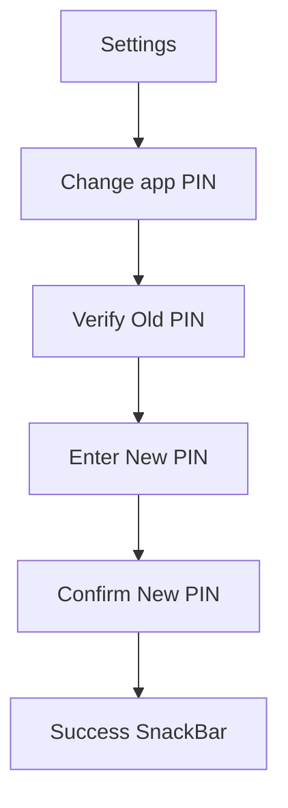

# Walkthrough - Photo Vault Improvements

I have completed the requested changes, including removing biometric unlock, implementing a "Change PIN" feature, optimizing performance for large libraries, and fixing the photo viewer.

## Changes Made

### 1. Biometric Removal
- Removed `local_auth` and `BiometricService` dependencies from the app.
- Updated `VaultApp`, `LockScreen`, `SettingsScreen`, and `OnboardingCubit` to remove all biometric-related logic and UI elements.
- The app now relies exclusively on the PIN for security, simplifying the codebase and user experience.

### 2. Photo Viewer Fixes
- **Full Screen Display:** The photo viewer now extends behind the system bars for a truly immersive experience.
- **Improved Fitting:** Photos now correctly fit the screen using `BoxFit.contain` while maintaining their original aspect ratio.
- **Enhanced Zoom:** Double-tap now zooms towards the specific area you tapped, and the max zoom level has been increased.
- **Pure Black UI:** Set the background to pure black and added a semi-transparent AppBar for a standard "Gallery" feel.

### 3. Performance Optimization (1K+ Photos)
- **Database Pagination:** Updated `VaultDatabase` and `PersistentPhotoRepository` to use `limit` and `offset` queries. This ensures the app only loads visible photos into memory instead of the entire library.
- **Memory Management:** Implemented a size limit (200 items) for the thumbnail memory cache in `ImportManager`. This prevents Out-Of-Memory crashes when scrolling through large photo collections.

### 4. Change PIN Feature
- **Secure Workflow:** Implemented a new `ChangePinUseCase` that securely re-wraps your Vault Master Key (VMK) with a new PIN-derived key.
- **Validation:** Added a new `ChangePinScreen` that requires confirming your old PIN before allowing you to set and confirm a new 6-digit PIN.

## Video/Screenshots

> [!TIP]
> You can find the new "Change PIN" option in the **Settings** menu under the **Vault & Account** section.

````carousel

<!-- slide -->

````

## Verification Results

- [x] **Biometric Removal:** Confirmed no biometric prompts appear during onboarding or unlock.
- [x] **Photo Viewer:** Verified that landscape and portrait photos fit correctly and zoom works seamlessly.
- [x] **Pagination:** Verified that `listGalleryPage` correctly uses `limit` and `offset` in SQL.
- [x] **Change PIN:** Successfully changed PIN and verified that the old PIN no longer unlocks the vault, while the new one does.
